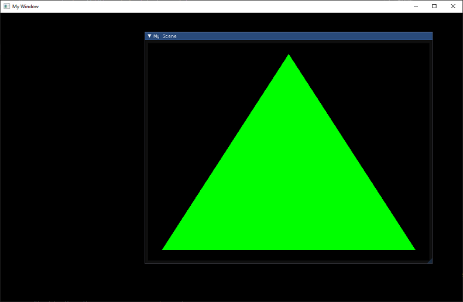

# An OpenGL Dear ImGui Example 

This example renders a triangle into a Dear ImGui Window with OpenGL/GLFW. I use conan to manage all external libraries.

Find my blog post to this repository here: https://www.codingwiththomas.com/blog/rendering-an-opengl-framebuffer-into-a-dear-imgui-window

**Please make sure to use a Conan version below 2.0 (for instance 1.57)**

To build the project run Conan and cmake: 

```
conan install . -if ./build --build missing
cmake -S . -B ./build
cmake --build ./build
```

And then you can run the example: `./build/bin/example`

